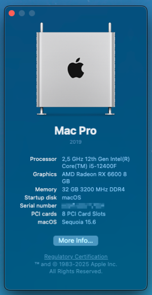
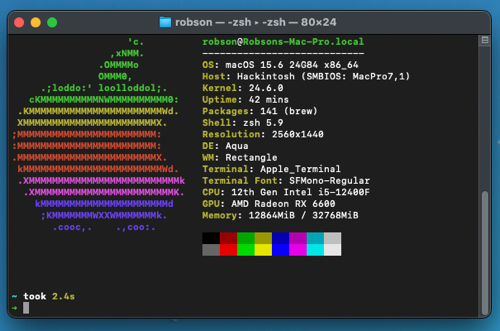

# Hackintosh MS-Challenger B660M (macOS Sequoia)

Fully working OpenCore configuration for macOS Sequoia (macOS 15.6 (24G84)) on MAXSUN MS-Challenger B660M with Intel Core i5-12400F and 51RISC (MSI MECH 2X) AMD Radeon RX 6600.

## Screenshots

## Specifications

- **Motherboard**: MAXSUN MS-Challenger B660M
- **CPU**: Intel Core i5-12400F (Alder Lake)
- **GPU**: 51RISC (MSI MECH 2X) AMD Radeon RX 6600 (Navi 23)
- **RAM**: MAXSUN MS-Avenger 32GB DDR4 3200MHz (2x16GB)
- **SSD**: Netac NV7000 1TB NVMe (PCIe 4.0 x4)
- **Wi-Fi/Bluetooth**: Fenvi T919 (BCM94360CD)
- **SMBIOS**: MacPro7,1 (Mac Pro (2019))

## Bootloader

- **OpenCore**: [1.0.5 (Release)](https://github.com/acidanthera/OpenCorePkg/releases)
- **OpenCore Legacy Patcher**: [2.4.0](https://github.com/dortania/OpenCore-Legacy-Patcher)

## Drivers

- **AudioDxe**: [OpenCore 1.0.5](https://github.com/acidanthera/OpenCorePkg/releases)
- **HfsPlus**: [OcBinaryData (Jan 4, 2023)](https://github.com/acidanthera/OcBinaryData)
- **OpenCanopy**: [OpenCore 1.0.5](https://github.com/acidanthera/OpenCorePkg/releases)
- **OpenRuntime**: [OpenCore 1.0.5](https://github.com/acidanthera/OpenCorePkg/releases)
- **ResetNvramEntry**: [OpenCore 1.0.5](https://github.com/acidanthera/OpenCorePkg/releases)

## Kexts

- **[AMFIPass 1.4.1](https://github.com/dortania/OpenCore-Legacy-Patcher/tree/main/payloads/Kexts/Acidanthera)**
- **[AppleALC 1.9.5](https://github.com/acidanthera/applealc/releases)**
- **[CpuTscSync 1.1.2](https://github.com/acidanthera/CpuTscSync/releases)**
- **[IO80211FamilyLegacy 1.0.0](https://github.com/dortania/OpenCore-Legacy-Patcher/tree/main/payloads/Kexts/Wifi)**
- **[IOSkywalkFamily 1.2.0](https://github.com/dortania/OpenCore-Legacy-Patcher/tree/main/payloads/Kexts/Wifi)**
- **[Lilu 1.7.1](https://github.com/acidanthera/Lilu/releases)**
- **[LucyRTL8125Ethernet 1.2.2](https://github.com/Mieze/LucyRTL8125Ethernet/releases)**
- **[NVMeFix 1.1.3](https://github.com/acidanthera/NVMeFix/releases)**
- **[RestrictEvents 1.1.6](https://github.com/acidanthera/RestrictEvents/releases)**
- **[SMCProcessor 1.3.7](https://github.com/acidanthera/virtualsmc/releases)**
- **[SMCRadeonSensors 2.3.1](https://github.com/ChefKissInc/SMCRadeonSensors/releases)**
- **[SMCSuperIO 1.3.7](https://github.com/acidanthera/virtualsmc/releases)**
- **[USBMap](https://github.com/corpnewt/USBMap)**
- **[USBWakeFixup](https://github.com/osy/USBWakeFixup)**
- **[VirtualSMC 1.3.7](https://github.com/acidanthera/virtualsmc/releases)**
- **[WhateverGreen 1.7.0](https://github.com/acidanthera/whatevergreen/releases)**

## Status

- **Working**: Everything
- **Not Working**: Nothing

## TODO

- [ ] Add BIOS settings
- [ ] Add screenshots

## Credits

Thanks to all developers and contributors of OpenCore, OpenCore Legacy Patcher, drivers, kexts, and tools used in this project. Checkout the links above for more information.

## License

This project is licensed under the MIT License - see the [LICENSE](LICENSE) file for details.
